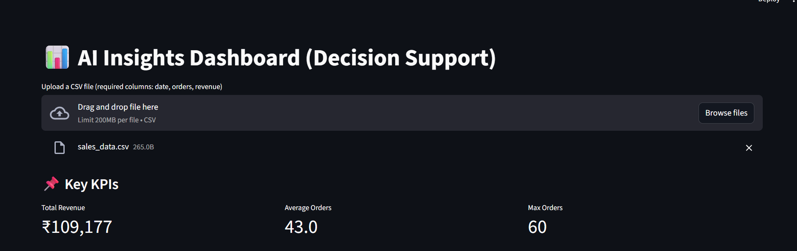
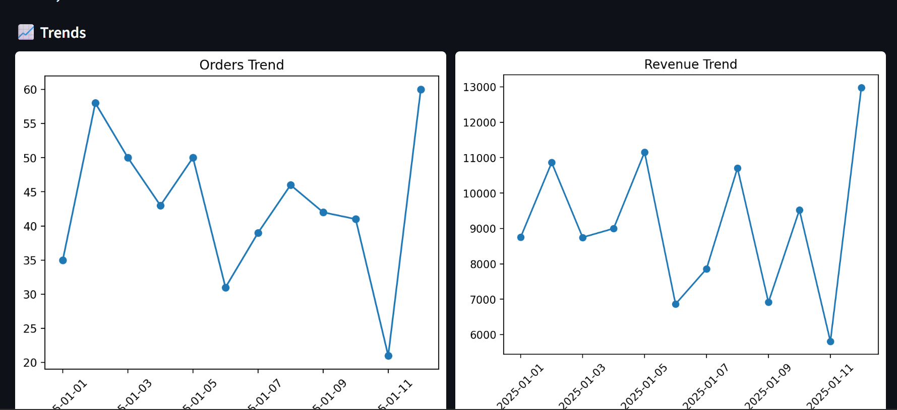

# AI Insights Dashboard (Decision Support System)

## Overview
The **AI Insights Dashboard** is an interactive, business-focused analytics tool that converts raw CSV data into **KPIs, trends, anomaly alerts, AI-generated insights, and downloadable reports**.

Users simply upload a CSV file and instantly receive **decision-ready insights**, without writing any code.

This project demonstrates **AI-assisted decision support**, not just data visualization.

---

## Business Problem
Business teams often:
- Spend time manually analyzing spreadsheets
- Miss critical trends and anomalies
- Struggle to convert numbers into decisions
- Depend on analysts for recurring reports

This leads to **slow decision-making and operational blind spots**.

---

## Solution
This dashboard provides:
- Instant KPI computation
- Visual trend analysis
- Automated anomaly detection
- AI-generated business insights
- Exportable PDF reports

All through a **simple upload-and-analyze workflow**.

---

## Key Features
- 📁 CSV Upload (no backend configuration)
- 📊 KPI Metrics (Revenue, Orders, Trends)
- 📈 Automated Charts
- 🚨 Anomaly Detection & Alerts
- 🤖 AI-Generated Insights (LLM-powered)
- ✍️ Prompt Control from UI
- 📄 One-click PDF Export
- 🧠 Business-first explanations

---

## Tech Stack
- Python 3.11
- Streamlit
- Pandas & NumPy
- Matplotlib
- Google Gemini API
- ReportLab (PDF generation)

---

## How It Works
1. User uploads a CSV file (`date`, `orders`, `revenue`)
2. System validates and processes data
3. KPIs and trends are calculated
4. Anomalies are detected using statistical methods
5. User edits the AI prompt directly in the UI
6. AI generates insights based on metrics
7. Insights can be exported as a PDF report

---

## Architecture
CSV Upload
↓
Data Validation
↓
KPI Computation
↓
Trend Visualization
↓
Anomaly Detection
↓
AI Insight Generation
↓
PDF Export


---

## Example Use Cases
- Sales performance analysis
- Business health monitoring
- Campaign impact evaluation
- Management reporting
- Quick decision support

---

## What Makes This an MVP (Not a Wrapper)
- AI supports decision-making, not replaces logic
- Business rules and statistics drive core analysis
- LLM is configurable from UI (no hardcoding)
- Handles real-world scenarios (spikes, drops)
- Produces actionable, manager-ready outputs

---

## How to Run Locally

### Install dependencies
```bash
pip install -r requirements.txt

Run the dashboard
streamlit run src/dashboard.py



